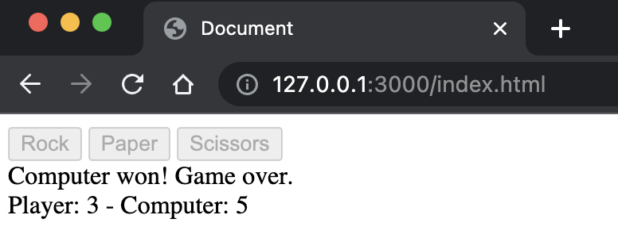

# rock-paper-scissors

This is a simple rock-paper-scissors game implemented using HTML and JavaScript. The game allows you to play against the computer and keeps track of your score and the computer's score. The first player to reach a score of 3 wins the game.

## Technologies Used
- HTML5
- Javascript (ES6)
- Visual Studio Code

## Features

- HTML: The HTML file (`index.html`) sets up the basic structure of the game interface. It includes a script tag to load the JavaScript file and defines the necessary elements for the game.

- JavaScript: The JavaScript file (`script.js`) contains the game logic. It includes functions for generating the computer's choice, determining the outcome of each round, and managing the overall game flow. The code showcases the use of conditionals, loops, functions, and string manipulation to create an interactive game experience.

- User Input Validation: The game includes user input validation to ensure that the player's choice is limited to "rock," "paper," or "scissors." If an invalid choice is entered, the player is prompted to enter a valid choice again.

## Usage

To play the game, simply open the `index.html` file in a web browser. A prompt will appear asking you to choose between "rock," "paper," or "scissors." Enter your choice, and the computer will randomly select its choice. The outcome of each round will be displayed in the console. The game will continue until either the player or the computer reaches a score of 3. The final result will be displayed in the console.

Feel free to modify the code to add more features, improve the user interface, or enhance the gameplay. Enjoy playing!

## Demo

You can view a live demo of the project [here](https://anthonynguyent.github.io/rock-paper-scissors/).

## Screenshots

*Player Input*

*Player Wins*

*Player Loses*

*UI with buttons, running score, and result screen*